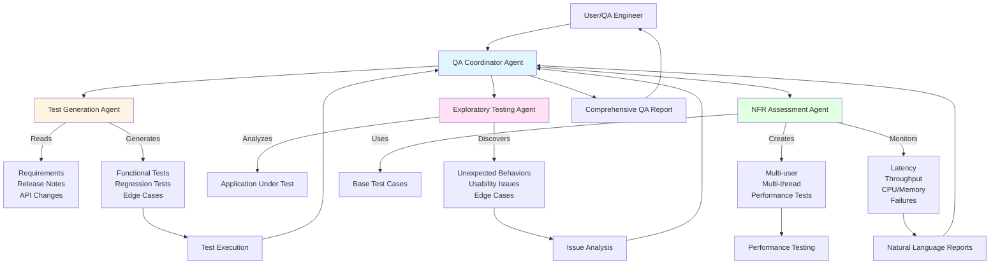
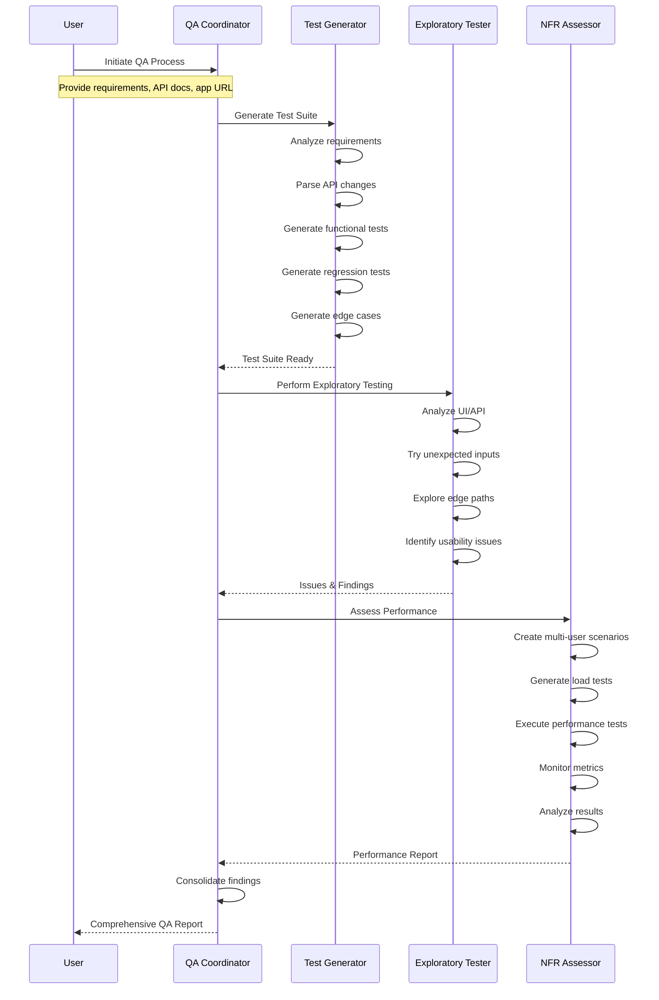

# Autonomous QA Agents for watsonx Orchestrate

An intelligent, multi-agent QA system that autonomously generates tests, explores applications, and assesses non-functional requirements (NFR) for comprehensive quality assurance.

## Overview

This system replaces traditional predefined test scripts with AI-powered agents that actively participate in the QA process, discovering issues and generating insights like human testers.

## Architecture



## Workflow



## Agents

### 1. Test Generation Agent
**Purpose**: Automatically generates comprehensive test suites from requirements and documentation.

**Capabilities**:
- Reads and analyzes requirements documents
- Parses release notes for changes
- Identifies API changes and impacts
- Generates functional test cases
- Creates regression test scenarios
- Produces edge case tests
- Outputs executable test scripts

**Tools**:
- `analyze_requirements` - Parse requirements documents
- `parse_release_notes` - Extract changes from release notes
- `detect_api_changes` - Identify API modifications
- `generate_functional_tests` - Create functional test cases
- `generate_regression_tests` - Create regression test suite
- `generate_edge_cases` - Identify and test edge scenarios

### 2. Exploratory Testing Agent
**Purpose**: Performs human-like exploratory testing to discover unexpected issues.

**Capabilities**:
- Explores UI/API autonomously
- Tries unexpected input combinations
- Discovers failure scenarios
- Identifies usability issues
- Tests boundary conditions
- Reports anomalies and suggestions

**Tools**:
- `explore_ui` - Navigate and interact with UI
- `test_unexpected_inputs` - Try edge case inputs
- `analyze_responses` - Evaluate system responses
- `identify_usability_issues` - Detect UX problems
- `discover_edge_cases` - Find boundary conditions
- `report_findings` - Document discovered issues

### 3. NFR Assessment Agent
**Purpose**: Creates and executes performance tests, monitors system metrics, and generates reports.

**Capabilities**:
- Scales base tests to multi-user scenarios
- Creates multi-threaded load tests
- Monitors latency and throughput
- Tracks CPU and memory usage
- Detects performance degradation
- Generates natural language reports

**Tools**:
- `create_load_tests` - Generate multi-user test scenarios
- `execute_performance_tests` - Run load tests
- `monitor_latency` - Track response times
- `monitor_throughput` - Measure request rates
- `monitor_resources` - Track CPU/memory usage
- `analyze_performance` - Evaluate results
- `generate_nfr_report` - Create performance report

### 4. QA Coordinator Agent
**Purpose**: Orchestrates the entire QA workflow and consolidates findings.

**Capabilities**:
- Manages agent workflow
- Distributes tasks to specialized agents
- Consolidates findings
- Generates comprehensive reports
- Provides actionable recommendations

**Tools**:
- `qa_orchestration_flow` - Main workflow coordinator

## Installation

1. Ensure you have watsonx Orchestrate ADK installed
2. Navigate to the project directory:
```bash
cd autonomous_qa_agents
```

3. Import all agents and tools:
```bash
./import-all.sh
```

## Usage

### Basic QA Process

```python
# Invoke the QA Coordinator Agent
# Provide:
# - Requirements document or URL
# - Release notes (optional)
# - Application URL or API endpoint
# - Test scope (functional, performance, exploratory, or all)

"Run comprehensive QA on the payment API using the requirements in requirements.pdf"
```

### Test Generation Only

```python
"Generate test cases for the user authentication feature based on the API documentation"
```

### Exploratory Testing Only

```python
"Perform exploratory testing on the checkout flow at https://app.example.com/checkout"
```

### Performance Testing Only

```python
"Run performance tests on the search API with 100 concurrent users"
```

## Example Scenarios

### Scenario 1: New Feature QA
```
User: "We've added a new payment processing feature. Here's the requirements doc and API spec. 
       Run full QA including functional, exploratory, and performance testing."

Coordinator:
1. Assigns Test Generation Agent to create test suite
2. Assigns Exploratory Agent to test UI/API flows
3. Assigns NFR Agent to run performance tests
4. Consolidates all findings into comprehensive report
```

### Scenario 2: Regression Testing
```
User: "We've updated the authentication service. Run regression tests to ensure nothing broke."

Coordinator:
1. Assigns Test Generation Agent to create regression suite
2. Executes tests and reports any failures
3. Provides impact analysis
```

### Scenario 3: Performance Baseline
```
User: "Establish performance baseline for the search API under load."

Coordinator:
1. Assigns NFR Agent to create load test scenarios
2. Executes multi-user performance tests
3. Generates baseline metrics report
```

## Output Reports

### Test Generation Report
- Total test cases generated
- Coverage analysis
- Test categories (functional, regression, edge cases)
- Executable test scripts

### Exploratory Testing Report
- Issues discovered
- Usability concerns
- Unexpected behaviors
- Severity ratings
- Reproduction steps

### NFR Assessment Report
- Performance metrics (latency, throughput)
- Resource utilization (CPU, memory)
- Scalability analysis
- Bottleneck identification
- Recommendations

### Consolidated QA Report
- Executive summary
- All findings from specialized agents
- Risk assessment
- Prioritized action items
- Quality score

## Project Structure

```
autonomous_qa_agents/
├── README.md                          # This file
├── import-all.sh                      # Deployment script
├── requirements.txt                   # Python dependencies
├── agents/
│   ├── test_generation_agent.yaml     # Test generator configuration
│   ├── exploratory_testing_agent.yaml # Explorer configuration
│   ├── nfr_assessment_agent.yaml      # Performance tester configuration
│   └── qa_coordinator_agent.yaml      # Coordinator configuration
└── tools/
    ├── __init__.py
    ├── test_generation/
    │   ├── __init__.py
    │   ├── analyze_requirements.py
    │   ├── parse_release_notes.py
    │   ├── detect_api_changes.py
    │   ├── generate_functional_tests.py
    │   ├── generate_regression_tests.py
    │   └── generate_edge_cases.py
    ├── exploratory_testing/
    │   ├── __init__.py
    │   ├── explore_ui.py
    │   ├── test_unexpected_inputs.py
    │   ├── analyze_responses.py
    │   ├── identify_usability_issues.py
    │   ├── discover_edge_cases.py
    │   └── report_findings.py
    ├── nfr_assessment/
    │   ├── __init__.py
    │   ├── create_load_tests.py
    │   ├── execute_performance_tests.py
    │   ├── monitor_latency.py
    │   ├── monitor_throughput.py
    │   ├── monitor_resources.py
    │   ├── analyze_performance.py
    │   └── generate_nfr_report.py
    └── orchestration/
        ├── __init__.py
        └── qa_orchestration_flow.py
```

## Key Features

- **Autonomous Operation**: Agents work independently without predefined scripts
- **Intelligent Test Generation**: Creates tests from natural language requirements
- **Human-like Exploration**: Discovers issues like a human tester would
- **Scalable Performance Testing**: Automatically creates multi-user scenarios
- **Natural Language Reports**: Easy-to-understand findings and recommendations
- **Comprehensive Coverage**: Functional, exploratory, and performance testing in one system

## Benefits

1. **Reduced Manual Effort**: Automates test creation and execution
2. **Better Coverage**: Discovers edge cases humans might miss
3. **Faster Feedback**: Parallel agent execution speeds up QA
4. **Consistent Quality**: Standardized testing approach
5. **Actionable Insights**: Clear, prioritized recommendations
6. **Continuous Improvement**: Agents learn from findings

## Requirements

- watsonx Orchestrate ADK v1.15.0+
- Python 3.9+
- Access to application under test
- Requirements/API documentation

## Support

For issues or questions, refer to the watsonx Orchestrate documentation or contact your administrator.

---

**Made with Bob** - Autonomous QA Agents for watsonx Orchestrate