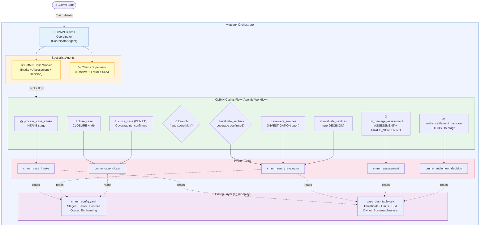
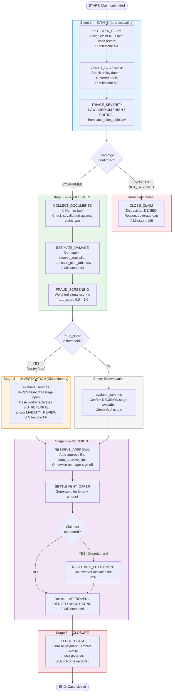

# CMMN Insurance Claims — watsonx Orchestrate

A production-grade implementation of **Case Management Model and Notation (CMMN)**
for insurance claims processing, built with IBM watsonx Orchestrate ADK.

---

## Overview

CMMN models processes where the sequence of tasks is **not fixed in advance**.
Unlike BPMN (where the flow is prescribed), CMMN gives knowledge workers the
power to activate tasks based on judgment, incoming evidence, and sentry conditions.

| CMMN Concept | Insurance Claims Mapping |
|---|---|
| **Case** | An insurance claim instance — uniquely identified, opened until resolved |
| **Stage** | Logical grouping: INTAKE → ASSESSMENT → INVESTIGATION → DECISION → CLOSURE |
| **Task** | A unit of work: AUTOMATED, HUMAN, or DISCRETIONARY |
| **Sentry** | Entry/exit guard: "fraud score ≥ 0.65 → open INVESTIGATION stage" |
| **Milestone** | Named checkpoint: M1 Claim Registered … M6 Case Closed |
| **Discretionary** | Optional task the case worker may invoke based on judgment |

---

## CMMN vs BPMN vs MDP — Key Differences

| Dimension | BPMN | CMMN | MDP |
|---|---|---|---|
| **Flow type** | Prescribed sequence | Judgment-driven, emergent | Policy-driven, optimised |
| **Who controls next step** | The process model | The knowledge worker | The learned policy π(s) |
| **Branching mechanism** | Gateways (XOR/AND) | Sentry conditions | State-action value function Q |
| **Best for** | Repeatable, structured processes | Complex, unpredictable cases | Optimisation under uncertainty |
| **Example** | Invoice processing | Insurance claim, medical treatment | Patient monitoring, risk pricing |

---

## Architecture Diagram



---

## Workflow Diagram



---

## CMMN Sentry Conditions

Sentries are the heart of CMMN — they guard task and stage activation:

| Sentry | Guards | Condition |
|---|---|---|
| Coverage confirmed | ASSESSMENT stage entry | `coverage_status == CONFIRMED` |
| Documents complete | ESTIMATE_DAMAGE entry | `COLLECT_DOCUMENTS completed` |
| Fraud score high | INVESTIGATION stage activation | `fraud_score ≥ fraud_score_flag (CSV)` |
| SIU referral | SIU_REFERRAL task entry | `fraud_score ≥ 0.65` |
| Counter-offer | NEGOTIATE_SETTLEMENT entry | `claimant_counter_offered == true` |
| Reserve approved | SETTLEMENT_OFFER entry | `reserve_approved == true` |
| Auto-approve | Bypass RESERVE_APPROVAL | `damage ≤ auto_approve_limit (CSV)` |

---

## Project Structure

```
cmmn_insurance_claims/
├── __init__.py
├── main_flow.py                              # 4-scenario local test harness
├── import-all.sh                             # one-command deploy
│
├── config/                                   # ← no code deploy to tune
│   ├── cmmn_config.yaml                      # Stages, tasks, sentries, milestones
│   │                                         # Owner: Engineering / Business Analysts
│   └── case_plan_table.csv                   # Thresholds, SLA %, reserve multiplier
│                                             # Owner: Claims Operations
│
├── tools/
│   ├── __init__.py
│   ├── config_loader.py                      # Shared YAML+CSV loader (lru_cache)
│   ├── cmmn_case_intake.py                   # INTAKE stage (3 automated tasks)
│   ├── cmmn_sentry_evaluator.py              # Sentry engine: available/blocked/discretionary
│   ├── cmmn_assessment.py                    # ASSESSMENT + FRAUD_SCREENING tasks
│   ├── cmmn_settlement_decision.py           # DECISION stage (auto-approve, negotiate)
│   ├── cmmn_case_closer.py                   # CLOSURE + milestone timeline
│   └── cmmn_claims_flow.py                   # @flow orchestration with branch nodes
│
├── agents/
│   ├── cmmn_case_worker_agent.yaml           # Primary: invokes CMMN flow
│   ├── cmmn_claims_supervisor_agent.yaml     # Reserve/fraud/SLA oversight
│   └── cmmn_claims_coordinator.yaml          # Coordinator + collaborators
│
└── generated/
    └── cmmn_insurance_claims_flow.json       # Compiled flow spec (auto-generated)
```

---

## Milestone Lifecycle

| Milestone | Triggered When | CMMN Role |
|---|---|---|
| M1 Claim Registered | REGISTER_CLAIM completes | Case opened — irrevocable |
| M2 Coverage Confirmed | VERIFY_COVERAGE confirms coverage | Unlocks ASSESSMENT stage |
| M3 Assessment Complete | ESTIMATE_DAMAGE completes | Unlocks DECISION stage |
| M4 Investigation Required | Fraud score ≥ threshold | Signals discretionary stage needed |
| M5 Decision Made | SETTLEMENT_OFFER or denial | Unlocks CLOSURE stage |
| M6 Case Closed | CLOSE_CLAIM completes | Terminal — case archived |

---

## Configuration Ownership

| File | What it controls | Who changes it |
|---|---|---|
| `config/cmmn_config.yaml` | Stage definitions, task types, sentry_in conditions, milestone triggers | Engineering + Business Analysts via PR |
| `config/case_plan_table.csv` | Severity thresholds, fraud cutoffs, auto-approve limits, SLA percentages, reserve multipliers | Claims Operations in Excel — no code deploy |

**The separation is intentional:** a claims ops manager can raise the fraud flag threshold from `0.65` to `0.70` for a specific claim type in one minute, without touching Python or redeploying the flow.

---

## Usage

### Deploy

```bash
cd cmmn_insurance_claims
./import-all.sh
```

### Local Tests (4 scenarios)

```bash
python cmmn_insurance_claims/main_flow.py
```

### Chat

```bash
orchestrate chat start --agent cmmn_claims_coordinator
```

**Example prompts:**

```
> Process a new AUTO claim for Alice Johnson, policy POL-2024-001,
  incident 2024-10-15, rear-end collision, damage $3,800.
  Documents: police report, photos, repair estimate, driver license.

> Bob Martinez filed a PROPERTY claim for $85,000. New policy, filed 2 months in.
  Weekend incident, inconsistent damage photos, multiple prior claims.
  What stage should this case be in?

> Carol Smith's MEDICAL claim — policy expired June 2024, incident July 2024.
  How should this be handled?

> David Chen's LIABILITY claim for $42,000 — he counter-offered at $48,000.
  What are the adjuster's options?
```

---

## Extending to Other Business Domains

The same CMMN architecture applies to any **knowledge-worker-driven case process**:

| Domain | Case | Discretionary Stages | Key Sentries |
|---|---|---|---|
| Healthcare | Patient treatment plan | Specialist referral, surgery | Diagnosis confirmed, lab results |
| Legal | Court case | Expert witness, appeal | Evidence admissible, precedent found |
| HR | Employee grievance | External mediator, tribunal | Escalation threshold, policy breach |
| Banking | Loan default | Debt restructuring, legal action | Payment missed, asset review done |
| Government | Permit application | Site inspection, public hearing | Objection filed, zoning check passed |

---

> ⚖️ **Disclaimer**: This system is a demonstration of CMMN architecture.
> All claim decisions require licensed adjuster review before execution.
> Do not use in production without regulatory and legal validation.
