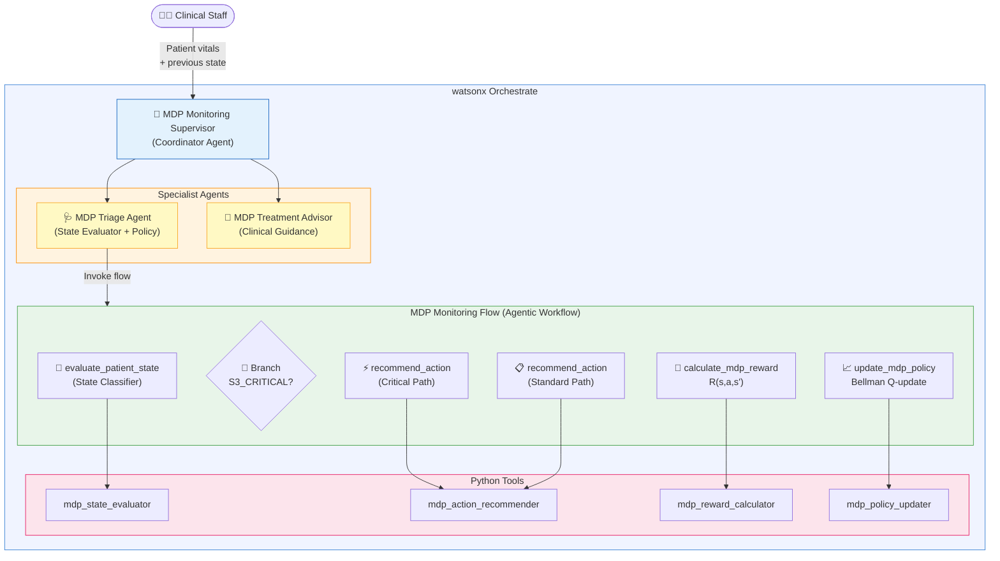
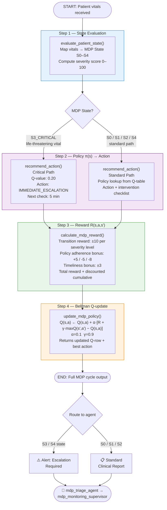

# MDP Patient Monitoring — watsonx Orchestrate

A production-grade implementation of a **Markov Decision Process (MDP)** for
healthcare patient monitoring, built with IBM watsonx Orchestrate ADK.

---

## Overview

This project models the continuous care loop in a hospital ward as an MDP where:

| MDP Component | Healthcare Mapping |
|---|---|
| **State S** | Patient acuity level derived from live vital signs |
| **Action A** | Clinical intervention (monitoring frequency, escalation path) |
| **Transition T(s,a,s')** | Next vital-sign observation after the action is taken |
| **Reward R(s,a,s')** | Outcome quality: did the patient improve? Was the policy followed? |
| **Policy π(s) → a** | Q-table trained via Bellman equation; updated after every cycle |

The system runs a full MDP cycle — **Evaluate → Branch → Act → Reward → Update** —
on every incoming set of patient vitals, continuously improving its policy through
Q-learning (α = 0.1, γ = 0.9).

---

## MDP State Space

```
S0_STABLE        — All vitals normal; routine 4-hour monitoring
S1_MILD          — One borderline vital; hourly nurse check
S2_MODERATE      — Multiple abnormal vitals; physician review (30 min)
S3_CRITICAL      — Life-threatening vital; Rapid Response Team activation
S4_DETERIORATING — Worsening trend from previous cycle; urgent intervention
```

## MDP Action Space

```
CONTINUE_MONITORING    → Standard 4-hour cycle
INCREASE_MONITORING    → Hourly nurse check
CLINICAL_REVIEW        → Attending physician within 30 minutes
IMMEDIATE_ESCALATION   → Rapid Response Team (CODE alert)
URGENT_INTERVENTION    → Attending + medication review within 15 minutes
```

---

## Architecture Diagram



---

## Workflow Diagram



---

## Project Structure

```
mdp_patient_monitoring/
├── __init__.py
├── main_flow.py                         # Local test harness (3 scenarios)
├── import-all.sh                        # One-command deployment script
│
├── config/                              # ← runtime configuration (no code deploy needed)
│   ├── mdp_config.yaml                  # States, actions, vitals thresholds, α/γ — engineers
│   └── policy_table.csv                 # Q-values, reward weights — clinical/ops owners
│
├── tools/
│   ├── __init__.py
│   ├── config_loader.py                 # Shared YAML+CSV loader (lru_cache, typed)
│   ├── mdp_state_evaluator.py           # Maps vitals → S0–S4 via config thresholds
│   ├── mdp_action_recommender.py        # Policy π(s): reads optimal action from CSV
│   ├── mdp_reward_calculator.py         # R(s,a,s'): all weights from CSV
│   ├── mdp_policy_updater.py            # Bellman update: α/γ from YAML, Q-seed from CSV
│   └── mdp_monitoring_flow.py           # Agentic workflow (flow decorator)
│
├── agents/
│   ├── mdp_triage_agent.yaml            # Triage: runs the MDP cycle
│   ├── mdp_treatment_advisor_agent.yaml # Treatment: clinical intervention detail
│   └── mdp_monitoring_supervisor.yaml  # Supervisor: coordinates both agents
│
└── generated/
    └── mdp_patient_monitoring_flow.json # Compiled flow spec (auto-generated)
```

---

## MDP Policy Table

| State | Q-value | Action | Escalation | Next Check |
|---|---|---|---|---|
| S0_STABLE | 0.95 | CONTINUE_MONITORING | Routine | 4 hours |
| S1_MILD | 0.78 | INCREASE_MONITORING | Nurse | 1 hour |
| S2_MODERATE | 0.55 | CLINICAL_REVIEW | Physician | 30 min |
| S3_CRITICAL | 0.20 | IMMEDIATE_ESCALATION | Rapid Response | 5 min |
| S4_DETERIORATING | 0.35 | URGENT_INTERVENTION | Attending | 15 min |

Q-values reflect expected long-term patient outcome; lower Q-values in high-severity
states indicate the difficulty of achieving good outcomes once the patient is critical.

---

## Bellman Q-Learning Update

After each monitoring cycle, the Q-table is updated:

```
Q(s, a) ← Q(s, a) + α · [R(s,a,s') + γ · max_a' Q(s', a') − Q(s, a)]
```

Where:
- **α = 0.1** — learning rate (conservative to avoid instability in production)
- **γ = 0.9** — discount factor (future rewards strongly valued)
- **R(s,a,s')** — immediate reward: transition quality + policy adherence + timeliness

---

## Usage

### Deploy to watsonx Orchestrate

```bash
cd mdp_patient_monitoring
./import-all.sh
```

### Run Local Tests

```bash
# From the workspace root
python mdp_patient_monitoring/main_flow.py
```

### Chat via CLI

```bash
orchestrate chat start --agent mdp_monitoring_supervisor
```

**Example prompts:**

```
> Patient P-1042: HR 72, BP 120/78, SpO2 98%, Temp 36.8°C, RR 15 — run monitoring check.

> Patient P-3017: HR 155, BP 65/40, SpO2 88%, Temp 40.5°C, RR 32 — previous state was S2_MODERATE.

> How does the MDP model make decisions?

> What is the Q-value for state S3_CRITICAL?
```

---

## Reward Function Design

The reward signal balances three objectives:

| Component | Value | Rationale |
|---|---|---|
| Patient improved (per severity level) | +10 | Primary objective |
| Patient worsened (per severity level) | −10 | Patient safety penalty |
| Action matched MDP policy | +5 | Policy adherence |
| Under-treatment (action too mild) | −5 | Safety risk |
| Over-treatment (unnecessary escalation) | −8 | Resource efficiency |
| Timely check completion | +3 | Process quality |
| Late check | −3 | SLA breach penalty |

---

## Extending This Pattern to Other Business Domains

The same MDP architecture applies directly to any business process with:
- Discrete states (e.g., customer churn risk, ticket severity, supply chain status)
- A policy mapping states to actions
- Observable outcomes that generate a reward signal

**Example adaptations:**

| Domain | States | Actions | Reward |
|---|---|---|---|
| Customer Service | Satisfaction tiers | Response channel / escalation | CSAT improvement |
| Supply Chain | Inventory levels | Reorder / expedite / hold | Stockout avoidance |
| IT Operations | System health grades | Alert / patch / rollback | MTTR / uptime |
| Financial Risk | Credit risk bands | Approve / review / decline | Default rate |

---

> ⚕ **Medical Disclaimer**: This system is a demonstration of AI/MDP architecture.
> All clinical recommendations require qualified physician review before execution.
> Do not use in production clinical environments without proper regulatory validation.
