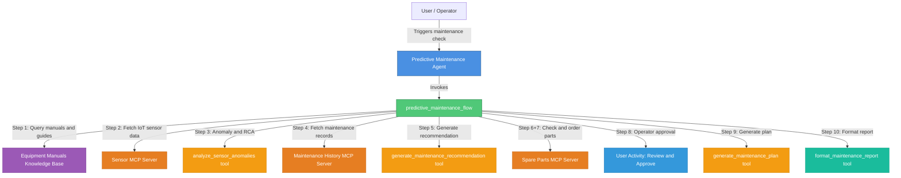
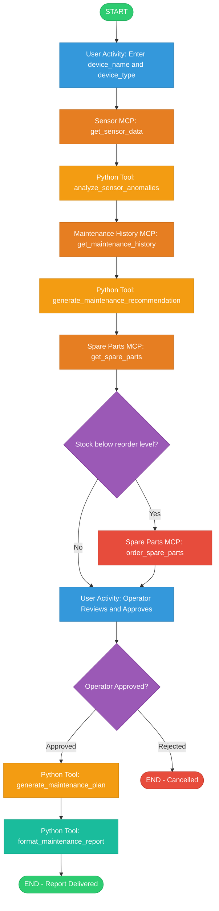

# Predictive Maintenance Agent — Implementation Plan

## Overview

This project creates a **Predictive Maintenance Agent** for manufacturing that orchestrates IoT sensor data, maintenance history, spare parts management, and equipment knowledge into a complete maintenance workflow.

The architecture uses a **native agent** backed by a **single orchestration flow** that calls three MCP servers and four Python tools, with a knowledge base for equipment documentation. The flow includes a **human-in-the-loop approval step** where the operator reviews the recommendation before the final maintenance plan is generated and formatted as a structured report.

---

## Architecture Diagram



---

## Workflow Diagram



---

## Project File Structure

```
predictive_maintenance_agent/
├── __init__.py
├── flow_main.py                                    # Programmatic testing script
├── import-all.sh                                   # CLI deployment script
├── README.md                                       # Documentation with diagrams
├── PLAN.md                                         # This planning document
├── agents/
│   └── predictive_maintenance_agent.yaml           # Native agent configuration
├── tools/
│   ├── __init__.py
│   ├── analyze_sensor_anomalies.py                 # @tool: anomaly detection + RCA
│   ├── generate_maintenance_recommendation.py      # @tool: recommendation from anomalies + history
│   ├── generate_maintenance_plan.py                # @tool: work items after approval
│   ├── format_maintenance_report.py                # @tool: structured Markdown report
│   └── predictive_maintenance_flow.py              # @flow: full 10-node orchestration
├── knowledge-bases/
│   └── equipment_manuals_kb.yaml                   # KB spec for manuals/procedures/guides
└── mcp_servers/
    ├── sensor_mcp_server/
    │   ├── server.py                               # MCP: get_sensor_data
    │   └── requirements.txt
    ├── maintenance_history_mcp_server/
    │   ├── server.py                               # MCP: get_maintenance_history
    │   └── requirements.txt
    └── spare_parts_mcp_server/
        ├── server.py                               # MCP: get_spare_parts + order_spare_parts
        └── requirements.txt
```

---

## Component Details

### 1. MCP Servers (3 servers, Python stdio transport)

Each server uses the `mcp` Python SDK with `stdio` transport and returns simulated data (ready to replace with real backends).

#### Sensor MCP Server (`mcp_servers/sensor_mcp_server/server.py`)

**Tool**: `get_sensor_data`

| Direction | Fields |
|---|---|
| Inputs | `device_name` (str), `device_type` (str), `timestamp` (str) |
| Outputs | JSON with: `temperature`, `vibration`, `pressure`, `humidity`, `power_consumption`, `rpm` |

#### Maintenance History MCP Server (`mcp_servers/maintenance_history_mcp_server/server.py`)

**Tool**: `get_maintenance_history`

| Direction | Fields |
|---|---|
| Inputs | `device_name` (str), `device_type` (str) |
| Outputs | List of records with: `maintenance_type`, `maintenance_date`, `completion_date`, `technician_name`, `cost`, `part_ids`, `downtime_hours`, `status`, `description` |

#### Spare Parts MCP Server (`mcp_servers/spare_parts_mcp_server/server.py`)

**Tools**: `get_spare_parts`, `order_spare_parts`

| Direction | Fields |
|---|---|
| Inputs | `part_id` (str), `part_number` (str), `part_name` (str), `category` (str), `manufacturer` (str) |
| Outputs | `stock_quantity`, `reorder_level`, `unit_price` |

`order_spare_parts` takes the same inputs plus `quantity_to_order` and returns an order confirmation.

---

### 2. Knowledge Base (`knowledge-bases/equipment_manuals_kb.yaml`)

A built-in Milvus knowledge base spec with placeholder document paths for:
- Equipment operation manuals
- Maintenance procedures and guides
- Troubleshooting documentation
- Safety protocols

The agent references this KB by name in its YAML, enabling it to answer questions about equipment procedures while the flow handles the operational workflow.

```yaml
spec_version: v1
kind: knowledge_base
name: equipment_manuals_kb
description: Equipment manuals, maintenance procedures, and operational guides for manufacturing equipment
documents:
  - path: docs/equipment_manual.pdf
  - path: docs/maintenance_procedures.pdf
  - path: docs/troubleshooting_guide.pdf
```

---

### 3. Python Tools (4 tools)

#### `tools/analyze_sensor_anomalies.py`
- **Decorator**: `@tool(permission=ToolPermission.READ_ONLY)`
- **Inputs**: `device_name`, `device_type`, `sensor_data` (JSON string with metrics)
- **Logic**: Threshold-based anomaly detection per metric (e.g., temperature > 85°C, vibration > 10 mm/s, pressure outside normal range)
- **Outputs**: `anomalies_detected` (bool), `anomaly_details` (list of flagged metrics with values and thresholds), `root_cause_analysis` (str), `severity_level` (critical/warning/normal)

#### `tools/generate_maintenance_recommendation.py`
- **Decorator**: `@tool(permission=ToolPermission.READ_ONLY)`
- **Inputs**: `device_name`, `device_type`, `anomaly_analysis` (JSON), `maintenance_history` (JSON)
- **Logic**: Combines anomaly severity with historical failure patterns to produce a recommendation
- **Outputs**: `urgency_level` (immediate/scheduled/monitor), `recommended_action` (str), `estimated_downtime_hours` (float), `required_parts` (list of part identifiers), `rationale` (str)

#### `tools/generate_maintenance_plan.py`
- **Decorator**: `@tool(permission=ToolPermission.READ_WRITE)`
- **Inputs**: `device_name`, `device_type`, `recommendation` (JSON), `parts_status` (JSON), `operator_notes` (str)
- **Logic**: Generates a structured work order with sequenced tasks
- **Outputs**: `plan_id` (str), `work_items` (list of tasks with: `task_id`, `title`, `description`, `assignee_role`, `estimated_duration_hours`, `priority`, `dependencies`, `required_parts`)

#### `tools/format_maintenance_report.py`
- **Decorator**: `@tool(permission=ToolPermission.READ_ONLY)`
- **Inputs**: All upstream data (device info, anomaly summary, recommendation, parts status, maintenance plan, operator notes, timestamp)
- **Logic**: Assembles all data into a structured Markdown report
- **Output**: `report` (str) — a complete Markdown document with:
  - Header with device info and report timestamp
  - Executive Summary (urgency level, recommended action)
  - Anomaly & Root Cause Analysis section
  - Maintenance History Summary section
  - Spare Parts Status section (with order confirmation if applicable)
  - Approved Maintenance Plan with numbered work items table
  - Operator sign-off notes

---

### 4. Orchestration Flow (`tools/predictive_maintenance_flow.py`)

**Decorator**: `@flow(name="predictive_maintenance_flow", ...)`

**Input Schema** (`PredictiveMaintenanceInput`):
```python
class PredictiveMaintenanceInput(BaseModel):
    device_name: str
    device_type: str
    timestamp: Optional[str]
```

**Node Sequence**:
```
START
  → user_activity(collect_device_info)          # Operator enters device_name, device_type
  → tool(get_sensor_data)                        # Sensor MCP: fetch IoT metrics
  → tool(analyze_sensor_anomalies)               # Anomaly detection + RCA
  → tool(get_maintenance_history)                # History MCP: fetch maintenance records
  → tool(generate_maintenance_recommendation)    # Build recommendation
  → tool(get_spare_parts)                        # Spare Parts MCP: check stock
  → if_else(stock_quantity <= reorder_level)
      true  → tool(order_spare_parts)            # Order parts if stock is low
      false → (merge)
  → user_activity(review_and_approve)            # Operator reviews + approves/rejects
  → if_else(approved == true)
      true  → tool(generate_maintenance_plan)    # Generate work items
               → tool(format_maintenance_report) # Format final report
               → END
      false → END (cancelled)
```

---

### 5. Native Agent YAML (`agents/predictive_maintenance_agent.yaml`)

```yaml
spec_version: v1
kind: native
name: predictive_maintenance_agent
description: AI agent for predictive maintenance in manufacturing...
instructions: |
  When user requests a maintenance check for a device:
  1. Immediately invoke the predictive_maintenance_flow tool
  2. The flow will collect device information, fetch sensor data, analyze anomalies,
     retrieve maintenance history, check spare parts, and present a recommendation
     for operator approval before generating the final maintenance plan and report.
  Use the equipment_manuals_kb knowledge base to answer questions about equipment
  procedures, specifications, or maintenance guidelines.
llm: groq/openai/gpt-oss-120b
style: default
knowledge_base:
  - equipment_manuals_kb
tools:
  - predictive_maintenance_flow
```

---

### 6. Import Script (`import-all.sh`)

Full CLI deployment sequence:
```bash
# 1. Import MCP toolkits (3 servers)
orchestrate toolkits import --kind mcp --name sensor_mcp \
  --description "IoT sensor data MCP server" \
  --package-root ./mcp_servers/sensor_mcp_server \
  --command "python server.py" --tools "*"

orchestrate toolkits import --kind mcp --name maintenance_history_mcp \
  --description "Maintenance history database MCP server" \
  --package-root ./mcp_servers/maintenance_history_mcp_server \
  --command "python server.py" --tools "*"

orchestrate toolkits import --kind mcp --name spare_parts_mcp \
  --description "Spare parts inventory MCP server" \
  --package-root ./mcp_servers/spare_parts_mcp_server \
  --command "python server.py" --tools "*"

# 2. Import Python tools (4 tools)
orchestrate tools import -k python -f tools/analyze_sensor_anomalies.py
orchestrate tools import -k python -f tools/generate_maintenance_recommendation.py
orchestrate tools import -k python -f tools/generate_maintenance_plan.py
orchestrate tools import -k python -f tools/format_maintenance_report.py

# 3. Import flow
orchestrate tools import -k flow -f tools/predictive_maintenance_flow.py

# 4. Import knowledge base
orchestrate knowledge-bases import -f knowledge-bases/equipment_manuals_kb.yaml

# 5. Import agent
orchestrate agents import -f agents/predictive_maintenance_agent.yaml
```

---

## Todo List

- [ ] Create project directory structure: `predictive_maintenance_agent/`
- [ ] Create MCP server: `sensor_mcp_server/` with `get_sensor_data` tool
- [ ] Create MCP server: `maintenance_history_mcp_server/` with `get_maintenance_history` tool
- [ ] Create MCP server: `spare_parts_mcp_server/` with `get_spare_parts` and `order_spare_parts` tools
- [ ] Create knowledge base YAML: `knowledge-bases/equipment_manuals_kb.yaml`
- [ ] Create Python tool: `tools/analyze_sensor_anomalies.py` (anomaly + root cause analysis)
- [ ] Create Python tool: `tools/generate_maintenance_recommendation.py`
- [ ] Create Python tool: `tools/generate_maintenance_plan.py` (plan + work items)
- [ ] Create Python tool: `tools/format_maintenance_report.py` (structured report formatter)
- [ ] Create flow: `tools/predictive_maintenance_flow.py` with 2 user_activity nodes, approval if_else, and report formatter
- [ ] Create agent YAML: `agents/predictive_maintenance_agent.yaml` with knowledge_base reference
- [ ] Create `flow_main.py` for programmatic testing
- [ ] Create `import-all.sh` deployment script (MCP toolkits + Python tools + flow + KB + agent)
- [ ] Create `README.md` with architecture and workflow diagrams
- [ ] Create `__init__.py` files

---

## Key Design Decisions

1. **MCP servers as local stdio servers** — Each MCP server is a standalone Python package under `mcp_servers/`. They use the `mcp` Python SDK and are imported via `orchestrate toolkits import --package-root`. This matches the ADK local MCP toolkit pattern.

2. **Single orchestration flow** — All workflow steps are wired into one `@flow` with conditional branches for spare parts ordering and operator approval. This keeps the agent simple (one tool to invoke) while the flow handles all complexity.

3. **Knowledge base on the agent** — The equipment manuals KB is attached directly to the native agent via the `knowledge_base` field in YAML, so the agent can answer questions about procedures while the flow handles the operational workflow.

4. **Human-in-the-loop approval** — A `user_activity` node pauses the flow after recommendation and parts check, presenting the operator with a full summary and requiring explicit approval before the maintenance plan is generated.

5. **Conditional spare parts ordering** — The flow uses `if_else` to check `stock_quantity <= reorder_level` and only calls `order_spare_parts` when needed.

6. **Structured report as final output** — `format_maintenance_report` assembles all upstream data into a single Markdown document, giving the operator a complete, printable maintenance work order.

7. **Pydantic models for all schemas** — All input/output schemas are defined as explicit Pydantic `BaseModel` classes (never dynamic type creation), following ADK best practices.

---

*Plan created: 2026-02-27*