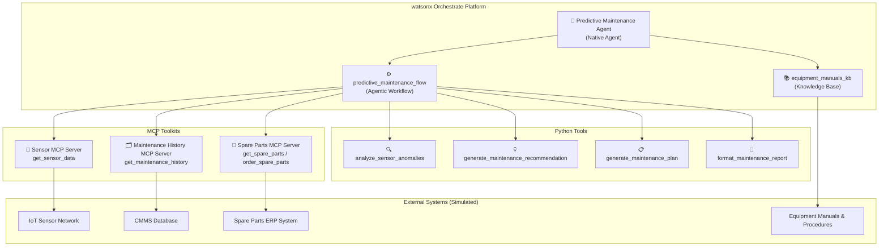
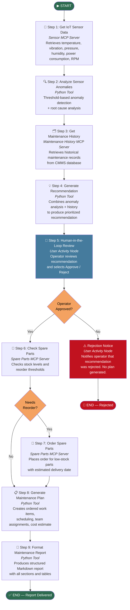

# Predictive Maintenance Agent

An IBM watsonx Orchestrate agent that delivers end-to-end **predictive maintenance** for manufacturing equipment. The agent collects real-time IoT sensor data, detects anomalies, retrieves maintenance history, generates prioritized recommendations, checks spare parts availability, and produces detailed maintenance plans — all with a human-in-the-loop approval step.

---

## Architecture Overview



---

## Workflow Diagram



---

## Project Structure

```
predictive_maintenance_agent/
├── __init__.py
├── flow_main.py                          # Local test script
├── import-all.sh                         # Deployment script
├── PLAN.md                               # Implementation plan
├── README.md                             # This file
│
├── agents/
│   └── predictive_maintenance_agent.yaml # Native agent specification
│
├── knowledge-bases/
│   ├── equipment_manuals_kb.yaml         # Knowledge base specification
│   └── docs/                             # Equipment manuals (PDF/DOCX)
│       ├── centrifugal_pump_manual.pdf
│       ├── air_compressor_manual.pdf
│       ├── electric_motor_manual.pdf
│       ├── conveyor_system_manual.pdf
│       ├── turbine_manual.pdf
│       └── ...
│
├── mcp_servers/
│   ├── sensor_mcp_server/
│   │   ├── server.py                     # FastMCP server: get_sensor_data
│   │   └── requirements.txt
│   ├── maintenance_history_mcp_server/
│   │   ├── server.py                     # FastMCP server: get_maintenance_history
│   │   └── requirements.txt
│   └── spare_parts_mcp_server/
│       ├── server.py                     # FastMCP server: get_spare_parts, order_spare_parts
│       └── requirements.txt
│
└── tools/
    ├── __init__.py
    ├── analyze_sensor_anomalies.py        # Anomaly detection + root cause analysis
    ├── generate_maintenance_recommendation.py  # Recommendation engine
    ├── generate_maintenance_plan.py       # Work item + plan generator
    ├── format_maintenance_report.py       # Markdown report formatter
    └── predictive_maintenance_flow.py     # Main agentic workflow
```

---

## Components

### MCP Servers

| Server | Tools | Description |
|--------|-------|-------------|
| `sensor_mcp_server` | `get_sensor_data` | Returns IoT metrics: temperature, vibration, pressure, humidity, power consumption, RPM |
| `maintenance_history_mcp_server` | `get_maintenance_history` | Returns CMMS records: maintenance type, dates, technician, cost, parts, downtime |
| `spare_parts_mcp_server` | `get_spare_parts`, `order_spare_parts` | Checks stock levels and places orders for spare parts |

### Python Tools

| Tool | Description |
|------|-------------|
| `analyze_sensor_anomalies` | Threshold-based anomaly detection with device-type-specific limits and root cause mapping |
| `generate_maintenance_recommendation` | Combines anomaly analysis + maintenance history to produce urgency level, action, parts list |
| `generate_maintenance_plan` | Generates ordered work items, safety precautions, team assignments, and cost estimates |
| `format_maintenance_report` | Formats the complete plan as a structured Markdown report with tables and sections |

### Agentic Workflow

**`predictive_maintenance_flow`** — 9-step orchestration pipeline with:
- Sequential tool chaining with explicit `map_input()` data mapping
- Two `userflow()` human-in-the-loop nodes (review + rejection notice)
- Two `branch()` conditional nodes (approval check + reorder check)
- Full `map_output()` for the final report

### Knowledge Base

**`equipment_manuals_kb`** — Indexes equipment manuals, maintenance procedures, safety guides, and troubleshooting documentation. The agent uses this to answer questions about specific equipment and reference procedures in recommendations.

---

## Supported Device Types

| Device Type | Description |
|-------------|-------------|
| `centrifugal_pump` | Centrifugal pumps |
| `air_compressor` | Air compressors |
| `electric_motor` | Electric motors |
| `conveyor` | Conveyor systems |
| `turbine` | Turbines |

---

## Sensor Metrics

| Metric | Unit | Description |
|--------|------|-------------|
| `temperature_celsius` | °C | Operating temperature |
| `vibration_mm_per_s` | mm/s | Vibration velocity |
| `pressure_bar` | bar | Operating pressure |
| `humidity_percent` | % | Ambient humidity |
| `power_consumption_kw` | kW | Electrical power draw |
| `rpm` | rpm | Rotational speed |

---

## Deployment

### Prerequisites

```bash
# Install the ADK
pip install ibm-watsonx-orchestrate

# Start the local server
orchestrate server start

# Activate your environment
orchestrate env activate <env-name>
```

### Deploy All Components

```bash
cd predictive_maintenance_agent
chmod +x import-all.sh
./import-all.sh
```

The script imports components in the correct dependency order:
1. MCP Toolkits (sensor, maintenance history, spare parts)
2. Python Tools (anomaly analysis, recommendation, plan, report)
3. Agentic Workflow (predictive_maintenance_flow)
4. Knowledge Base (equipment_manuals_kb)
5. Native Agent (predictive_maintenance_agent)

---

## Testing

### Local Flow Test

```bash
cd predictive_maintenance_agent

# Test with default device (PUMP-001, centrifugal_pump)
python flow_main.py

# Test with specific device
python flow_main.py --device-name COMP-003 --device-type air_compressor

# Test with timestamp
python flow_main.py --device-name MOTOR-007 --device-type electric_motor \
    --timestamp 2025-01-15T10:30:00Z
```

### Chat Interface Test

```bash
orchestrate chat start
# Select: predictive_maintenance_agent
```

**Example prompts:**
- `"Run predictive maintenance analysis for PUMP-001 (centrifugal_pump)"`
- `"Check sensor data for COMP-003"`
- `"What is the maintenance history for MOTOR-007?"`
- `"Check spare parts availability for BEAR-002"`
- `"What does the manual say about bearing replacement for centrifugal pumps?"`

---

## Sample Output

When the flow completes successfully, the agent delivers a structured Markdown report:

```
# 🔧 Predictive Maintenance Report — PUMP-001
**Plan ID:** `MP-A3F2B1C4` | **Generated:** 2025-01-15 14:32 UTC

> 🔴 **IMMEDIATE ACTION REQUIRED**

## Executive Summary
| Field | Value |
|---|---|
| **Device** | PUMP-001 |
| **Device Type** | Centrifugal Pump |
| **Urgency Level** | 🔴 IMMEDIATE |
| **Anomaly Severity** | 🔴 CRITICAL |
| **Anomalies Detected** | 2 |
| **Scheduled Date** | 2025-01-15 18:32 UTC |
| **Est. Downtime** | 12.0 hours |
| **Est. Total Cost** | $2,847.50 USD |
| **Priority Score** | 10/10 |

## Recommended Action
Emergency shutdown and thermal inspection...

## Work Items
| # | Task | Category | Duration (hrs) | Skill Required | Tools Required |
|---|---|---|---|---|---|
| 1 | Safety isolation and LOTO procedure | 🦺 Safety | 0.5 | Certified Technician | LOTO kit, Voltage tester |
| 2 | Thermal inspection and temperature measurement | 🔧 Maintenance | 1.0 | Mechanical Technician | Infrared thermometer |
...
```

---

## Notes

- **MCP Servers use simulated data** — Replace the simulation logic in each `server.py` with real database/API calls for production use.
- **Knowledge base documents** — Add actual PDF/DOCX equipment manuals to `knowledge-bases/docs/` before importing the knowledge base.
- **Branch evaluator linter warnings** — The `branch(evaluator=...)` string expressions produce basedpyright type warnings. These are false positives; the ADK accepts plain string expressions at runtime as documented.

---

*Made with Bob*