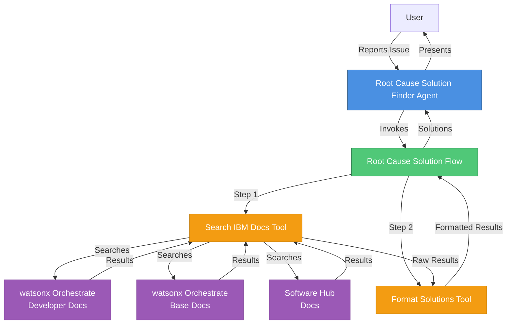
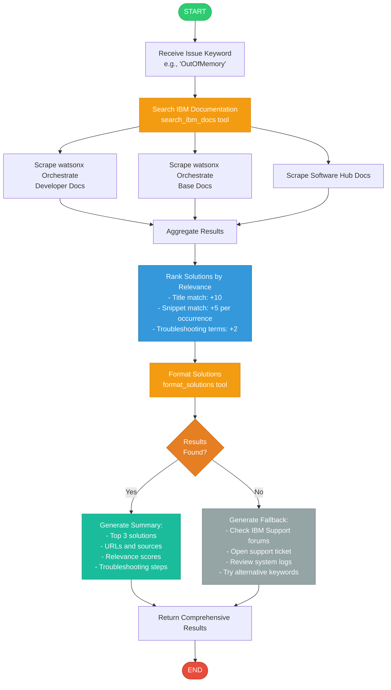

# Root Cause Solution Finder Agent

## Overview

The **Root Cause Solution Finder** is an intelligent watsonx Orchestrate agent that helps users troubleshoot common issues by searching IBM documentation sources. When users report errors like "OutOfMemory", "CrashLoopBackOff", or "Connection refused", the agent automatically searches multiple IBM documentation repositories, ranks solutions by relevance, and provides comprehensive troubleshooting guidance.

## Features

- **Multi-Source Documentation Search**: Recursively searches across:
  - IBM watsonx Orchestrate Developer Documentation
  - IBM watsonx Orchestrate Base Documentation
  - IBM Software Hub Documentation
  
- **Intelligent Ranking**: Ranks solutions by relevance using keyword matching and context analysis

- **Comprehensive Guidance**: Provides:
  - Top-ranked solutions with direct links
  - Step-by-step troubleshooting instructions
  - Preventive measures and best practices
  - Alternative search suggestions when no results are found

- **Error Handling**: Robust error handling with fallback recommendations

## Architecture Diagram



## Workflow Diagram



## Project Structure

```
root_cause_solution_finder/
├── __init__.py                           # Python package initialization
├── README.md                             # This file
├── import-all.sh                         # Import script for CLI deployment
├── tools/                                # Tool implementations
│   ├── __init__.py
│   ├── search_ibm_docs.py               # Web scraping tool for IBM docs
│   └── root_cause_solution_flow.py      # Flow orchestrating the search
├── agents/                               # Agent configurations
│   └── root_cause_solution_finder.yaml  # Agent YAML configuration
└── generated/                            # Generated artifacts (created at runtime)
    └── root_cause_solution_flow.json    # Compiled flow specification
```

## Usage

### Via Chat UI (Recommended)

1. **Import the agent and tools**:
   ```bash
   cd root_cause_solution_finder
   ./import-all.sh
   ```

2. **Start the chat interface**:
   ```bash
   orchestrate chat start
   ```

3. **Select the agent**:
   - Choose `root_cause_solution_finder` from the agent list

4. **Ask about issues**:
   ```
   User: "Help me troubleshoot OutOfMemory errors in watsonx Orchestrate"
   User: "I'm getting CrashLoopBackOff errors, what should I do?"
   User: "Connection refused error when connecting to the database"
   ```

### Programmatically

1. **Set PYTHONPATH**:
   ```bash
   export PYTHONPATH=/path/to/watsonx-orchestrate-adk/src:/path/to/watsonx-orchestrate-adk
   ```

2. **Create a test script** (optional):
   ```python
   import asyncio
   from root_cause_solution_finder.tools.root_cause_solution_flow import build_root_cause_solution_flow
   
   async def main():
       flow_def = await build_root_cause_solution_flow().compile_deploy()
       result = await flow_def.invoke({
           "issue_keyword": "OutOfMemory"
       }, debug=True)
       print(result)
   
   if __name__ == "__main__":
       asyncio.run(main())
   ```

## Example Interactions

### Example 1: OutOfMemory Error

**User Input:**
```
"I'm experiencing OutOfMemory errors in my watsonx Orchestrate deployment"
```

**Agent Response:**
```markdown
I found 15 potential solutions for 'OutOfMemory' across 3 documentation sources.

## Top Recommendations:

1. **Memory Configuration for watsonx Orchestrate Pods**
   - Source: watsonx Orchestrate Base Docs
   - URL: https://www.ibm.com/docs/en/watsonx/watson-orchestrate/base/troubleshooting/memory
   - Relevance: 10/10
   - Preview: OutOfMemory errors typically occur when pods exceed their memory limits...

2. **Tuning JVM Heap Settings**
   - Source: Software Hub Docs
   - URL: https://www.ibm.com/docs/en/software-hub/5.3.x/reference/jvm-tuning
   - Relevance: 8/10
   - Preview: Adjust JVM heap size using -Xmx and -Xms parameters...

3. **Monitoring Memory Usage**
   - Source: watsonx Orchestrate Developer
   - URL: https://developer.watson-orchestrate.ibm.com/docs/monitoring
   - Relevance: 7/10
   - Preview: Use kubectl top pods to monitor memory consumption...

## Troubleshooting Steps:

1. Check current memory limits: `kubectl describe pod <pod-name>`
2. Review memory usage patterns in monitoring dashboards
3. Increase memory limits in deployment YAML if needed
4. Consider implementing memory leak detection
5. Review application logs for memory-intensive operations
```

### Example 2: CrashLoopBackOff

**User Input:**
```
"My pods are in CrashLoopBackOff state"
```

**Agent Response:**
```markdown
I found 12 potential solutions for 'CrashLoopBackOff' across 3 documentation sources.

## Top Recommendations:

1. **Diagnosing CrashLoopBackOff in Kubernetes**
   - Source: watsonx Orchestrate Base Docs
   - URL: https://www.ibm.com/docs/en/watsonx/watson-orchestrate/base/troubleshooting/crashloop
   - Relevance: 10/10
   - Preview: CrashLoopBackOff indicates that a pod is repeatedly crashing...

[Additional solutions and troubleshooting steps...]
```

## Components

### 1. Search IBM Docs Tool (`search_ibm_docs.py`)

A Python tool that:
- Accepts an issue keyword as input
- Searches multiple IBM documentation sources
- Extracts relevant content using BeautifulSoup
- Ranks results by relevance
- Returns top 10 solutions

**Key Features:**
- Recursive documentation traversal
- Keyword-based relevance scoring
- Snippet extraction with context
- Error handling for network issues

### 2. Root Cause Solution Flow (`root_cause_solution_flow.py`)

An agentic workflow that:
- Orchestrates the search process
- Formats results for presentation
- Generates comprehensive summaries
- Provides fallback recommendations

**Flow Steps:**
1. **Search Documentation**: Invokes `search_ibm_docs` tool
2. **Format Results**: Invokes `format_solutions` tool to create structured output

### 3. Root Cause Solution Finder Agent (`root_cause_solution_finder.yaml`)

A native agent that:
- Understands user queries about issues
- Invokes the root cause solution flow
- Presents results in a user-friendly format
- Provides additional context and guidance

## Configuration

### Supported Issue Keywords

The agent works best with specific error terms:
- `OutOfMemory` / `OOM`
- `CrashLoopBackOff`
- `Connection refused` / `ECONNREFUSED`
- `Timeout` / `Connection timeout`
- `ImagePullBackOff`
- `Pending` (pod status)
- `Error` / `Failed`
- `Authentication failed`
- `Certificate` / `SSL` / `TLS`
- Any specific error code or message

### Documentation Sources

The tool searches these IBM documentation sites:
1. **watsonx Orchestrate Developer**: https://developer.watson-orchestrate.ibm.com/
2. **watsonx Orchestrate Base Docs**: https://www.ibm.com/docs/en/watsonx/watson-orchestrate/base
3. **Software Hub Docs**: https://www.ibm.com/docs/en/software-hub/5.3.x

## Dependencies

- `requests`: HTTP library for web scraping
- `beautifulsoup4`: HTML parsing library
- `ibm_watsonx_orchestrate`: watsonx Orchestrate SDK

Install dependencies:
```bash
pip install requests beautifulsoup4
```

## Error Handling

The agent includes robust error handling:

1. **Network Errors**: Gracefully handles connection failures and timeouts
2. **No Results Found**: Provides alternative recommendations
3. **Invalid Keywords**: Suggests reformulating the search query
4. **Documentation Unavailable**: Falls back to alternative sources

## Best Practices

1. **Be Specific**: Use exact error messages or keywords for best results
2. **Provide Context**: Mention the component or service experiencing the issue
3. **Follow Links**: Review the full documentation at provided URLs
4. **Verify Environment**: Ensure solutions match your deployment environment
5. **Escalate if Needed**: Open IBM Support tickets for unresolved issues

## Limitations

- **Web Scraping**: Results depend on documentation site structure and availability
- **Network Access**: Requires internet connectivity to access IBM documentation
- **Rate Limiting**: May be subject to rate limits on documentation sites
- **Content Updates**: Documentation changes may affect search accuracy

## Future Enhancements

Potential improvements:
- Integration with IBM Support API for ticket search
- Caching of frequently accessed documentation
- Support for additional IBM product documentation
- Integration with Stack Overflow and IBM Community forums
- Machine learning-based relevance ranking
- Multi-language support

## Troubleshooting

### Import Fails

**Issue**: `orchestrate tools import` fails
**Solution**: 
- Ensure PYTHONPATH is set correctly
- Verify all dependencies are installed
- Check that `__init__.py` files exist in all directories

### No Results Found

**Issue**: Agent returns no solutions
**Solution**:
- Try alternative keywords (e.g., "OOM" instead of "OutOfMemory")
- Check internet connectivity
- Verify documentation URLs are accessible
- Review agent logs for errors

### Slow Response

**Issue**: Agent takes too long to respond
**Solution**:
- Documentation sites may be slow or rate-limiting
- Consider implementing caching
- Reduce the number of search paths in `search_ibm_docs.py`

## Support

For issues or questions:
1. Check the [watsonx Orchestrate documentation](https://developer.watson-orchestrate.ibm.com/)
2. Review the [ADK GitHub repository](https://github.com/IBM/ibm-watsonx-orchestrate-adk)
3. Open an issue in your project repository
4. Contact IBM Support for production issues

## License

This project follows the same license as the IBM watsonx Orchestrate ADK.

## Contributing

Contributions are welcome! Please:
1. Follow the watsonx Orchestrate ADK coding standards
2. Add tests for new features
3. Update documentation
4. Submit pull requests with clear descriptions

---

**Version**: 1.0.0  
**Last Updated**: 2026-03-05  
**Author**: IBM watsonx Orchestrate Team