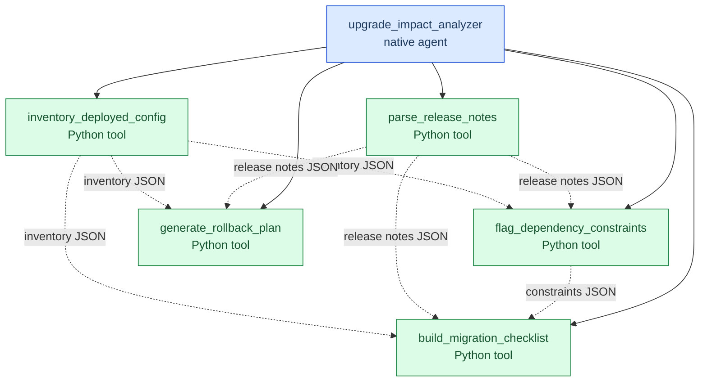
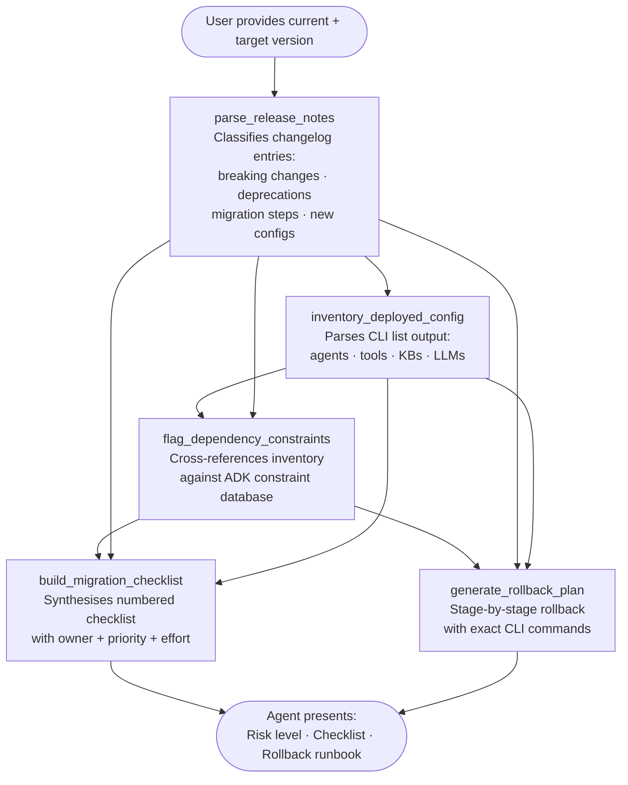

# Upgrade Impact Analyzer & Rollback Planner

A watsonx Orchestrate agent that analyses the impact of a wxO version upgrade **before** it is applied.  It parses release notes, inventories the deployed configuration, flags breaking changes and deprecated APIs, produces an ordered migration checklist with owner assignments, and generates a stage-by-stage rollback plan with exact CLI commands.

---

## Architecture Diagram



---

## Workflow Diagram



---

## Tool Summary

| Tool | Purpose | Key Outputs |
|------|---------|-------------|
| [`parse_release_notes`](tools/parse_release_notes.py) | Classify changelog entries | Breaking changes, deprecations, migration steps, risk level |
| [`inventory_deployed_config`](tools/inventory_deployed_config.py) | Parse `orchestrate * list` output | Agents, tools by kind, KBs, LLM models in use |
| [`flag_dependency_constraints`](tools/flag_dependency_constraints.py) | Check against ADK constraint DB | HIGH/MEDIUM/LOW flagged items, import path changes, API renames |
| [`build_migration_checklist`](tools/build_migration_checklist.py) | Build ordered checklist | Numbered steps, P0–P3 priority, owner, effort, Markdown export |
| [`generate_rollback_plan`](tools/generate_rollback_plan.py) | Stage-by-stage rollback | CLI commands per stage, decision tree, Markdown runbook |

---

## Project Structure

```
upgrade_impact_analyzer/
├── __init__.py
├── import-all.sh                    # One-shot deployment script
├── README.md
├── agents/
│   └── upgrade_impact_analyzer_agent.yaml
└── tools/
    ├── __init__.py
    ├── parse_release_notes.py        # Tool 1: Classify changelog entries
    ├── inventory_deployed_config.py  # Tool 2: Parse CLI list output
    ├── flag_dependency_constraints.py # Tool 3: ADK constraint cross-reference
    ├── build_migration_checklist.py  # Tool 4: Ordered migration checklist
    └── generate_rollback_plan.py     # Tool 5: Stage-by-stage rollback plan
```

---

## Usage

### 1. Deploy to watsonx Orchestrate

```bash
cd upgrade_impact_analyzer
orchestrate env activate <your-environment>
./import-all.sh
```

### 2. Start the analysis

```bash
orchestrate chat start
# Select: upgrade_impact_analyzer
```

### 3. Example conversation

```
You: Analyse the upgrade from 1.10.0 to 1.15.0

Agent: I'll guide you through the upgrade impact analysis.
       Please provide:
       1. The release notes text from https://developer.watson-orchestrate.ibm.com/release/release
          (include all versions between 1.10.0 and 1.15.0)
       2. Output of: orchestrate agents list -v
       3. Output of: orchestrate tools list -v
       4. (Optional) Output of: orchestrate knowledge-bases list
       5. (Optional) Your requirements.txt content

You: [paste release notes + CLI output]

Agent: Analysis complete. Risk level: MEDIUM
       Found 2 breaking changes, 4 deprecations.
       Migration checklist: 12 items (3 P0-Critical, 5 P1-High, 4 P2-Medium)
       Rollback plan: 8 stages, ~85 minutes estimated.
       ...
```

---

## What Gets Analysed

### Breaking Change Detection
The release notes parser classifies every changelog line against patterns for:
- `breaking change`, `removed`, `renamed`, `dropped`, `no longer supported`
- `migration required`, `must update`, `requires manual`
- `behavior change`, `regression`

### ADK Constraint Database
The constraint flagging tool has a built-in database of known ADK API changes including:
- Import path migration (`ibm_watsonx_ai` → `ibm_watsonx_orchestrate.agent_builder.tools`)
- `docclassfier()` → `docclassifier()` rename (ADK 1.11.0)
- Connection manager migration from `.env` to `orchestrate connections` (ADK 1.5.0)
- Knowledge base `--path` flag removal (ADK 1.7.0)
- Flows endpoint path change `/flows` → `/v1/flows` (ADK 1.7.0)
- A2A protocol 0.2/0.2.1 deprecation (ADK 1.15.0)
- SaaS dual-environment credential requirement (ADK 1.6.0)

### Migration Checklist Priorities
- **P0-Critical** — Must be resolved before upgrade; upgrade will fail without it
- **P1-High** — Should be resolved; may cause runtime errors if skipped
- **P2-Medium** — Should be addressed before the next version upgrade
- **P3-Low** — Best-practice housekeeping; no immediate impact

### Rollback Stages
1. Halt Upgrade (decision gate)
2. Revert ADK pip package
3. Remove partially-upgraded agents and tools
4. Restore agents from backup exports
5. Restore tools from backup exports
6. Restore knowledge bases
7. On-premises operator rollback (OpenShift, if applicable)
8. Post-rollback verification

---

## Made with Bob
