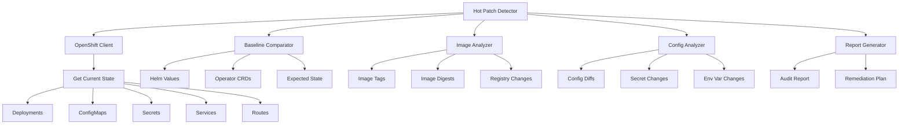

# watsonx Orchestrate OpenShift Hot Patch Detector

A comprehensive tool for detecting hot patches applied to watsonx Orchestrate deployments on Red Hat OpenShift clusters.

## Overview

When watsonx Orchestrate is deployed on OpenShift using operators and Helm charts, customer support teams may apply hot patches to resolve production issues. These patches can include:

- Modified container images (with different tags or digests)
- Changed ConfigMaps or Secrets
- Updated environment variables
- Modified resource limits/requests
- Patched deployment configurations
- Custom init containers or sidecars
- Modified persistent volume claims
- Changed service configurations

This tool helps identify all such modifications by comparing the current deployment state against the expected baseline from the operator/Helm chart.

## Architecture



## Detection Methods

### 1. Container Image Verification

Detects:
- Image tag mismatches (e.g., `v1.0.0` vs `v1.0.0-hotfix`)
- Image digest changes
- Images from non-standard registries
- Images with `:latest` tag in production
- Custom or unofficial images

### 2. ConfigMap/Secret Analysis

Detects:
- Modified configuration files
- Added/removed configuration keys
- Changed values from baseline
- Annotations indicating manual edits
- Timestamps showing recent modifications

### 3. Deployment Configuration Changes

Detects:
- Modified resource limits/requests
- Changed replica counts
- Added init containers or sidecars
- Modified volume mounts
- Changed security contexts
- Custom annotations or labels

### 4. PVC and Volume Mount Analysis

Detects:
- PVCs with hot patch naming (hotfix, patch, emergency, temp)
- PVCs with hot patch annotations
- Unexpected PVCs not in baseline
- Volume mounts to code directories (/app, /code, /src, /lib, /opt/app)
- PVC mounts that may contain Python hot patch files
- Volume mounts with hot patch indicators in names

**Common Hot Patch Pattern:**
Support teams often create a PVC containing modified Python files and mount it to `/app` or `/opt/ibm` to override application code without rebuilding container images.

### 5. Helm Release Comparison

Detects:
- Values that differ from Helm chart defaults
- Manual `kubectl` edits after Helm deployment
- Resources not managed by Helm
- Helm release status anomalies

### 6. Operator Reconciliation Bypass

Detects:
- Resources with operator reconciliation disabled
- Custom resources with unexpected specs
- Operator-managed resources with manual modifications

## Features

### Comprehensive Detection

- **Multi-namespace scanning**: Scan entire OpenShift cluster or specific namespaces
- **Resource type coverage**: Deployments, StatefulSets, DaemonSets, ConfigMaps, Secrets, Services, Routes
- **Baseline comparison**: Compare against Helm values, operator CRDs, or custom baselines
- **Historical tracking**: Track changes over time with audit logs

### Detailed Reporting

- **Severity classification**: Critical, High, Medium, Low based on impact
- **Change categorization**: Image changes, config changes, resource changes
- **Remediation guidance**: Specific steps to properly apply changes
- **Export formats**: JSON, YAML, HTML, Markdown

### Integration Capabilities

- **OpenShift CLI integration**: Uses `oc` commands
- **Kubernetes API**: Direct API access for detailed inspection
- **Helm integration**: Compare with Helm release values
- **Operator integration**: Validate against operator expectations
- **CI/CD integration**: Run as part of deployment pipelines

## Installation

### Prerequisites

```bash
# OpenShift CLI
oc version

# Helm (optional, for Helm-based deployments)
helm version

# Python 3.8+
python --version

# Required Python packages
pip install -r requirements.txt
```

### Setup

```bash
# Clone or download the detector
cd wxo_openshift_hotpatch_detector

# Install dependencies
pip install -r requirements.txt

# Configure OpenShift access
oc login https://your-openshift-cluster:6443

# Verify access to watsonx Orchestrate namespace
oc project watsonx-orchestrate
```

## Usage

### Quick Start

```bash
# Scan watsonx Orchestrate namespace
python detector.py scan --namespace watsonx-orchestrate

# Scan with baseline comparison
python detector.py scan \
  --namespace watsonx-orchestrate \
  --baseline helm-values.yaml \
  --output report.html

# Scan specific resources
python detector.py scan \
  --namespace watsonx-orchestrate \
  --resources deployments,configmaps \
  --severity high
```

### Command Line Interface

```bash
# Scan namespace
python detector.py scan --namespace <namespace>

# Compare with Helm release
python detector.py scan \
  --namespace <namespace> \
  --helm-release <release-name>

# Compare with operator baseline
python detector.py scan \
  --namespace <namespace> \
  --operator-baseline operator-config.yaml

# Generate detailed report
python detector.py scan \
  --namespace <namespace> \
  --output report.html \
  --format html \
  --include-recommendations

# Scan multiple namespaces
python detector.py scan \
  --namespaces watsonx-orchestrate,watsonx-orchestrate-dev \
  --output multi-ns-report.json
```

### Python API

```python
from wxo_hotpatch_detector import OpenShiftHotPatchDetector

# Create detector
detector = OpenShiftHotPatchDetector(
    namespace="watsonx-orchestrate",
    kubeconfig="/path/to/kubeconfig"
)

# Scan for hot patches
result = detector.scan()

# Print findings
for finding in result.findings:
    print(f"{finding.severity}: {finding.resource_type}/{finding.resource_name}")
    print(f"  Issue: {finding.description}")
    print(f"  Recommendation: {finding.recommendation}")

# Compare with baseline
baseline = detector.load_baseline("helm-values.yaml")
result = detector.compare_with_baseline(baseline)

# Generate report
from wxo_hotpatch_detector.reporters import ReportGenerator
reporter = ReportGenerator()
reporter.generate_html(result, "hotpatch-report.html")
```

## Detection Examples

### Example 1: Modified Container Image

```yaml
# Expected (from Helm chart)
image: icr.io/cpopen/watsonx-orchestrate:1.0.0

# Actual (hot patched)
image: icr.io/cpopen/watsonx-orchestrate:1.0.0-hotfix-20240315
```

**Detection**: Image tag mismatch, non-standard tag format
**Severity**: High
**Recommendation**: Document the hotfix and update Helm values

### Example 2: Modified ConfigMap

```yaml
# Expected
apiVersion: v1
kind: ConfigMap
metadata:
  name: wxo-config
data:
  max_connections: "100"

# Actual (hot patched)
apiVersion: v1
kind: ConfigMap
metadata:
  name: wxo-config
  annotations:
    hotfix: "2024-03-15 - Increased connections for production load"
data:
  max_connections: "500"  # Changed
```

**Detection**: ConfigMap value changed, hotfix annotation present
**Severity**: Medium
**Recommendation**: Update Helm chart with new value

### Example 3: Added Init Container

```yaml
# Actual deployment has additional init container not in baseline
initContainers:
- name: hotfix-migration
  image: custom-migration:latest
  command: ["/bin/sh", "-c", "run-emergency-migration.sh"]
```

**Detection**: Unexpected init container, uses :latest tag
**Severity**: Critical
**Recommendation**: Remove init container, apply migration through proper upgrade process

### Example 4: Modified Resource Limits

```yaml
# Expected
resources:
  limits:
    memory: "4Gi"
    cpu: "2"

# Actual (hot patched)
resources:
  limits:
    memory: "8Gi"  # Doubled
    cpu: "4"       # Doubled
```

**Detection**: Resource limits increased beyond baseline
**Severity**: Medium
**Recommendation**: Update Helm values if increased resources are needed

## Report Formats

### HTML Report

Interactive report with:
- Executive summary with severity breakdown
- Detailed findings by resource type
- Side-by-side comparison views
- Remediation recommendations
- Export to PDF capability

### JSON Report

Machine-readable format for:
- CI/CD pipeline integration
- Automated alerting
- Trend analysis
- Custom processing

### Markdown Report

Documentation-friendly format for:
- Incident reports
- Change documentation
- Knowledge base articles
- Team communication

## Best Practices

### Regular Scanning

```bash
# Weekly production scan
0 0 * * 0 /path/to/scan-wxo-production.sh

# scan-wxo-production.sh
#!/bin/bash
python detector.py scan \
  --namespace watsonx-orchestrate \
  --baseline /baselines/production-baseline.yaml \
  --output /reports/weekly-$(date +%Y%m%d).html \
  --format html
```

### Baseline Management

1. **Create baseline after initial deployment**
   ```bash
   python detector.py export-baseline \
     --namespace watsonx-orchestrate \
     --output baseline-v1.0.0.yaml
   ```

2. **Update baseline after approved changes**
   ```bash
   python detector.py export-baseline \
     --namespace watsonx-orchestrate \
     --output baseline-v1.1.0.yaml
   ```

3. **Version control baselines**
   ```bash
   git add baselines/baseline-v1.1.0.yaml
   git commit -m "Update baseline for watsonx Orchestrate v1.1.0"
   ```

### Hot Patch Documentation

When a hot patch is detected:

1. **Document immediately**
   - What was changed
   - Why it was changed
   - Who approved it
   - Expected duration

2. **Create tracking ticket**
   - Link to incident
   - Remediation plan
   - Target date for proper fix

3. **Update baseline temporarily**
   - Mark as known hot patch
   - Set expiration date
   - Add remediation notes

4. **Plan proper fix**
   - Update Helm chart
   - Test in non-production
   - Schedule deployment
   - Remove hot patch

## Integration with CI/CD

### GitLab CI

```yaml
# .gitlab-ci.yml
hotpatch-scan:
  stage: verify
  script:
    - python detector.py scan --namespace watsonx-orchestrate --format json --output scan.json
    - |
      if [ $(jq '.summary.critical' scan.json) -gt 0 ]; then
        echo "Critical hot patches detected!"
        exit 1
      fi
  artifacts:
    reports:
      junit: scan.json
```

### Jenkins

```groovy
pipeline {
    agent any
    stages {
        stage('Scan for Hot Patches') {
            steps {
                sh '''
                    python detector.py scan \
                      --namespace watsonx-orchestrate \
                      --format json \
                      --output hotpatch-scan.json
                '''
                script {
                    def scan = readJSON file: 'hotpatch-scan.json'
                    if (scan.summary.critical > 0) {
                        error("Critical hot patches detected!")
                    }
                }
            }
        }
    }
}
```

## Troubleshooting

### Common Issues

**Issue**: Cannot connect to OpenShift cluster

```bash
# Solution: Verify login and permissions
oc whoami
oc auth can-i get deployments -n watsonx-orchestrate
```

**Issue**: Baseline comparison shows many false positives

```bash
# Solution: Update baseline or use ignore patterns
python detector.py scan \
  --namespace watsonx-orchestrate \
  --baseline baseline.yaml \
  --ignore-patterns ignore-patterns.yaml
```

**Issue**: Missing permissions to read secrets

```bash
# Solution: Grant necessary RBAC permissions
oc create clusterrolebinding hotpatch-detector \
  --clusterrole=cluster-admin \
  --serviceaccount=default:hotpatch-detector
```

## Security Considerations

- Store baselines in version control
- Encrypt sensitive baseline data
- Use service accounts with minimal permissions
- Audit all hot patch detections
- Implement approval workflows for baseline updates
- Regular security scans of detector itself

## Contributing

See the main project README for contribution guidelines.

## License

Apache 2.0